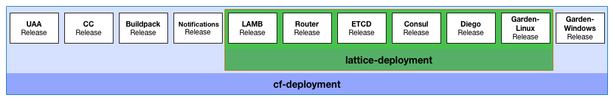

# The Road to Composing BOSH Releases

A number of pivots met to discuss a vision for moving away from monolithic BOSH releases towards smaller BOSH releases.

## Where we are today

CF-Release is a monolithic BOSH release containing just about *everything*.  Diego-Release is also a monolithic BOSH release.

#### Problems with this

- There is duplicate code shared between CF-Release and Diego-Release that has probably already diverged (e.g. etcd)
- Deploying Diego involves a complicated dance around merging CF's templates into Diego's templates.
- It is currently difficult to track compatible versions of Diego + CF
- It is difficult and awkward to describe how one might BOSH deploy Lattice (i.e. Diego + Router + LAMB)
- Teams are all up in each other's business - constantly bumping CF-Release
- CF-Release being a monolith hides circular dependencies (e.g. LAMB depends on CC which depends on LAMB)
- CF-Release and Diego-Release both conflate BOSH releases with BOSH deployment templates

## Where we want to end up

We envision a world where every major component (or logical grouping of components) is its own BOSH Release.  These releases would contain code, tests, and job & packaging specs with appropriately namespaced properties.

A separate repository called a *deployment* repository that acts as the glue that combines disparate releases together into a vetted grouping.  The deployment repository would contain templates (potentially for a variety of targets), integration tests that validate the deployment, and pointers to concrete versions of all the releases it depends on.

Teams will be responsible for their own Releases and collaborate on keeping the deployment(s) up-to-date.  Presumably one team (e.g. runtime) would be responsible for keeping the deployment green (typically by poking the team that contributed a component that broke the release).

BOSH may add some tooling around easing someworkflows here (e.g. downloading releases via URLs, knowing how to create and upload multiple releases given a deployment)

Here's what the world might look like someday:

## FAQ

- *I'm an OSS consumer of CF.  Is my life now harder with all these releases?*

  No.  As an OSS consumer you still only download one repository (`cf-deployment`).  This will have all the information necessary to perform a BOSH deploy.  It may even have baked-in URLs pointing to final-release tarballs that you can just download and deploy with a single `bosh deploy`.

- *I'm an OSS developer.  Is my life now harder with all these releases?*

  Not necessarily.  You can still tweak code in an individual release.  You then create & upload said release and then run `bosh deploy` with the manifest generated by the deployment.  You will have to keep `cf-deployment` in-sync with the release if you make changes to the properties however, so that might be a new point of friction.

- *I'm an OSS team member working on CF every day.  Is my life now harder with all these releases?*

    Hopefully not.  There are now cleaner delineations of responsibility and dependencies become more explicit.  With the new decoupling you will rarely be blocked on CF-Release being red for reasons outside of your control: you can continue to work on your release and defer integration until CF-Release is green again (unless, of course, you're the reason CF is red).
  
- *What about shared jobs*?

    We think this actually gets a lot nicer with releases broken out in this way.  Let's take etcd as a concrete example.

    Runtime, LAMB and Diego all rely on etcd.  We run two different etcd clusters (one for Diego and one for Runtime+LAMB).  By sharing an etcd release we reduce code duplication and can invest unified effort in maintaining a correct BOSH release of etcd.  When Diego needs to update etcd Runtime+LAMB need *not* update etcd as it will be possible for the two to reference different versions of the release in cf-deployment.

- *What about shared packages*?
    
    We propose either duplicating shared compile-time packages or using git submodules to solve this problem.  If this becomes a pain-point BOSH can try to help.

## Concrete baby steps for Diego

1. Create `diego-deployment` by pulling out all our Diego-Release templates out of Diego-Release and into `diego-deployment`.  Evaluate the developer and consumer experience once this is done.  `diego-deployment` points to vetted compatible versions of CF-Release and Diego-Release.   CF-Release will still have its templates.  `diego-deployment` lays the groundwork for someday becoming `cf-deployment`.
2. Start consuming `garden-linux` via `garden-linux-release` instead of duplicating `garden-linux` code.  `garden-linux` moves out of `diego-release` and into `diego-deployment`.
3. Pull out `etcd` into its own release and have `diego-deployment` refer to it.
4. Present our results to other teams and evaluate next steps.
