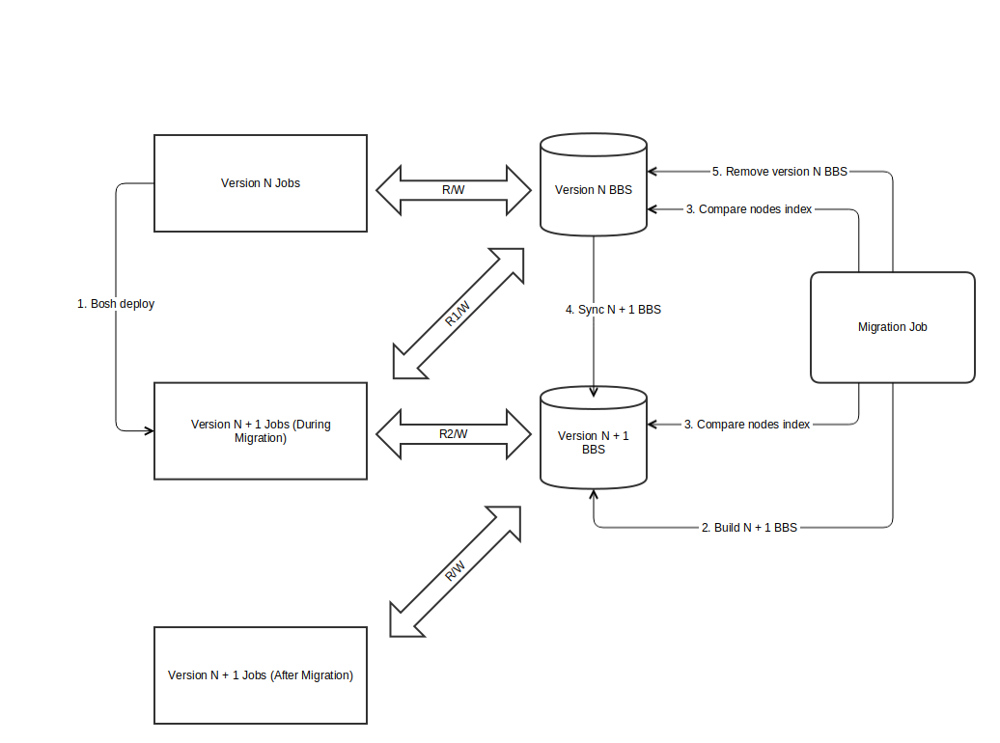

# Versioning

## BBS Semantics

There are likely to be a class of updates that require a modification to the
structure or semantics of the BBS. An example might be the movement of egress
rules from the desired LRP to a separate part of the BBS. This change would
effectively create a new set of keys for egress rules and would change the
semantics of a desired LRP with the requirement to reference the egress rules.

Changes like this would required a more involved upgrade process such as:

1. Code is deployed with a BBS version that understands old and new semantics
2. While running, code operates with the old BBS version semantics, can read
	 new, writes old
3. An operator (or some other entity) explicitly bumps the BBS version via an
	 errand
4. The BBS code in each component eventually discovers the new operating mode
	 and generates new data structures and uses new semantics
5. Migration phase to move to new levels - errand does the migration after
	 setting the new active version

The BBS version needs to be stored in a consistent, persistent place outside of
the BBS. We can't put the version directly into the BBS since a loss of our
persistent store would leave us unable to determine the appropriate semantics
to use when the diego jobs restart.

Options to where to store this version are consul or the manifest. Problem with
the manifest being the necessity of a manual manifest-only deploy.

## Schema Models

Each model has its own version that can grow independently of the Diego release
version. A bump in a model version may (and in most cases must) trigger a major
bump on the Diego release version.

A new version of a model requires creating a new structure (code) in the BBS
with the version number in its name. That structure, when marshalled should
write a `version` field. Unmarshalling of any JSON payload should read the
version and create the appropirate object. Version 1 is implied if no version
is present on the payload.

Adding an optional field does not require bumping the version.
Removing an optional field does not require bumping the version.
Adding a model does not require bumping the version.

## Internal APIs

APIs themselves are not explicitly versioned, we inherit the version from the
schema models being passed through the requests.

Internal servers should respond with the same version that was received.

We do not preclude the addition of new endpoints and messages; if the semantics
of an operation change significantly, a new endpoint is likely warranted and
the (updated) client will need a mechanism to detect the new capability. (Can
use bbs?)

## Upgrades

Consider a current major version N. When you deploy version N+1 it has the
ability to read and write the new and old BBS data models. Prior to migration,
it will always write the old data model but it can understand the new model;
after migration, it can still understand the old model but it will only write
the new data model. Once the migration completes, code running version N will
no longer function correctly.

This results in two simple rules for operators:

1. You **SHOULD** run the migration errand *after* deploying N + 1.
2. You **MUST** run the migration errand *before* deploying N + 2.

An alternative BBS Schema Migration Approach
--------------------------------------------

# Steps

1. Bosh deploy Diego Release version N + 1.
2. Run migration errand

# Changes to Jobs

Jobs need a way to detect if they're running in a mode where they dont' have to
worry about backwards compatibility. We could model that as a flag on the
command line or we could find a way to do it in the BBS. Any of those
mechanisms could work...

With that in place:

1. Version N + 1 Jobs read from version N BBS first, then read from version N +
	 1 if that operation fails
2. Version N + 1 Jobs to write to version N and N + 1 BBS 
3. Version N + 1 jobs to read/write from/to version N + 1 BBS when the
	 migration flag is turned off.  Migration flag is turned off when version N
	 BBS is not available.

# Migration Errand

1. Build version N + 1 BBS
2. Scan version N BBS nodes for discrepencies by comparing its node index to
   N + 1 BBS nodes (version N nodes are always going to be greater than or equal
	 to version N + 1 nodes) 
3. Update out of sync node in N + 1 BBS
4. Build a nodes-in-sync lookup table for nodes with the same node index
	 between version N and N + 1.
5. Repeat 2 until all nodes are in sync
6. Delete version N BBS
